# Pipeline Hub — Phase 8 시나리오 사용자 매뉴얼

## 매뉴얼 개요

본 매뉴얼은 **공용 데이터 수집 파이프라인 플랫폼**으로 4 유통사 (이마트 / 홈플러스 /
롯데마트 / 하나로마트) 의 가격·행사·재고 데이터를 수집·표준화·통합하는 *시나리오
리허설* 의 화면 별 절차를 정리한 문서다.

**작성 기준**:
- Phase 8 acceptance — 코딩 0줄로 4 유통사 + 외부 push (크롤러/OCR/소상공인 업로드)
  데이터를 같은 service_mart 로 통합
- 가상 데이터 시드 완료 시점 (commit `478b7bb`)

**대상 독자**: 운영자 / 데이터 매니저. 개발자 도움 없이 화면만으로 새 채널 추가
가능해야 함.

---

## 0. 사전 준비

### 0.1 인프라 가동
```bash
# Docker — Postgres / Redis / MinIO
cd infra && docker-compose up -d

# Backend — http://127.0.0.1:8000
cd backend
.venv/Scripts/alembic.exe upgrade head
.venv/Scripts/python.exe -c "import asyncio, sys; asyncio.set_event_loop_policy(asyncio.WindowsSelectorEventLoopPolicy()); import uvicorn; uvicorn.run('app.main:create_app', factory=True, host='127.0.0.1', port=8000)"

# Frontend — http://localhost:5173
cd frontend && pnpm dev

# Phase 8 데이터 시드 (4 유통사 + 가상 시나리오)
cd backend && PYTHONIOENCODING=utf-8 PYTHONPATH=. .venv/Scripts/python.exe ../scripts/phase8_seed_full_e2e.py
```

### 0.2 가상 데이터 채널

| 가상 채널 | 도메인 | 특징 |
|---|---|---|
| 이마트 | `emart` | 표준 API 형 — 정상 케이스 대표 |
| 홈플러스 | `homeplus` | 행사/할인 데이터 풍부 |
| 롯데마트 | `lottemart` | 상품명 정규화 난이도 높음 (low confidence) |
| 하나로마트 | `hanaro` | 농축수산물 산지/등급/단위 풍부 |

---

## STEP 1 — 로그인

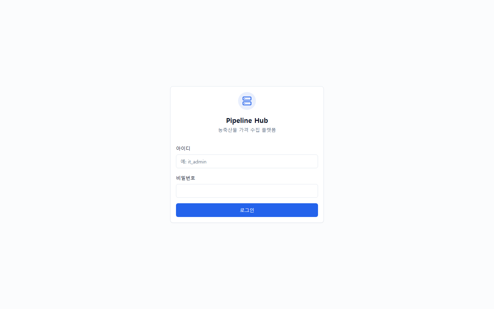

**기능**: ID / 비밀번호 입력 후 JWT 발급. 권한 (ADMIN / APPROVER / OPERATOR /
REVIEWER) 에 따라 메뉴 노출.

**시나리오 적용**: `admin` / `admin` (Phase 8 시드 기본 계정).

**다음 스텝**: 로그인 성공 시 Dashboard 자동 진입.

---

## STEP 2 — Dashboard

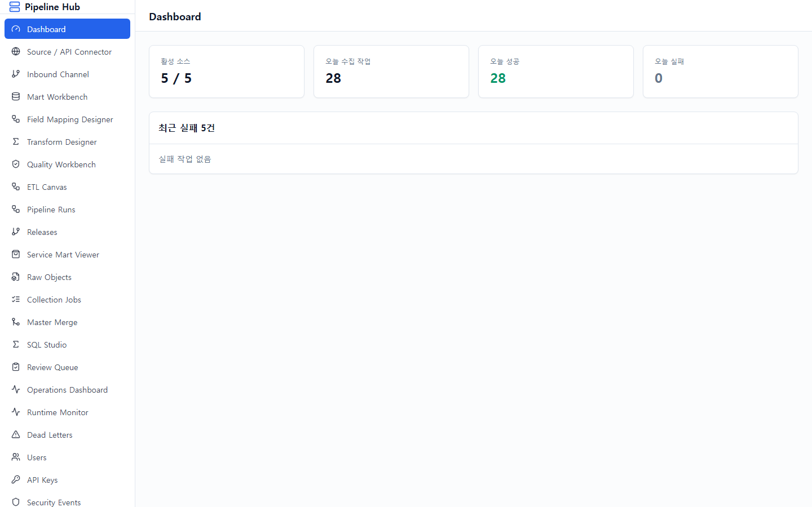

**기능**: 시스템 전반 현황 한 눈에 보기. 최근 run, 실패율, 적재 row 수.

**시나리오 적용**: 전체 4 유통사 + service_mart 의 통합 운영 상태 확인.

**다음 스텝**: 좌측 메뉴 **"Source / API Connector"** 클릭 → 4 유통사 API 등록 확인.

---

## STEP 3 — Source / API Connector

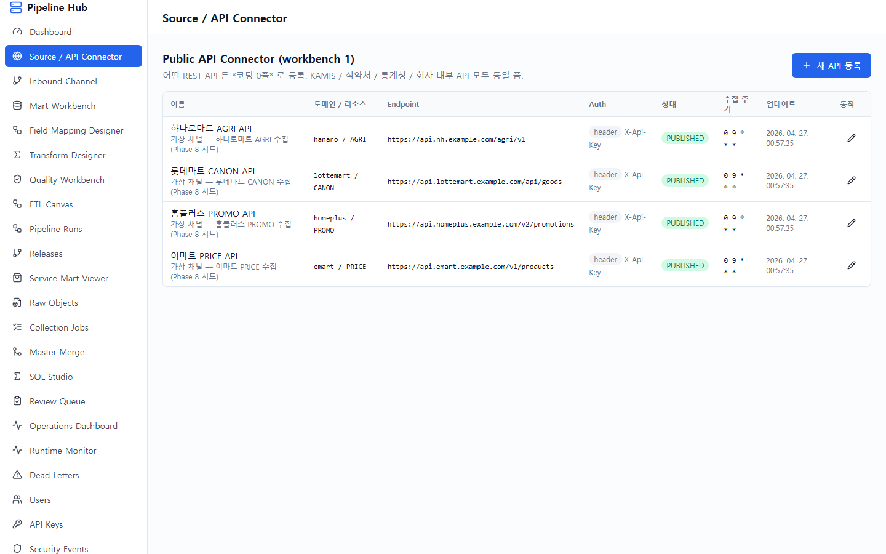

**기능**: 외부 OpenAPI 등록 (URL + 인증 + 파라미터 + 응답 형식). 코딩 없이 새
유통사 API 추가.

**시나리오 적용** (이미 시드됨):
- `이마트 PRICE API` → `emart_mart.product_price` (표준 API)
- `홈플러스 PROMO API` → `homeplus_mart.product_promo` (행사/할인)
- `롯데마트 CANON API` → `lottemart_mart.product_canon` (상품명 정규화)
- `하나로마트 AGRI API` → `hanaro_mart.agri_product` (산지/등급/단위)

각 connector 는 *PUBLISHED* 상태 + cron `0 9 * * *` 활성. 인증 = `X-Api-Key` 헤더.

**다음 스텝**: **"Inbound Channel"** 클릭 → 외부 push 채널 (크롤러/OCR/업로드)
확인.

---

## STEP 4 — Inbound Channel

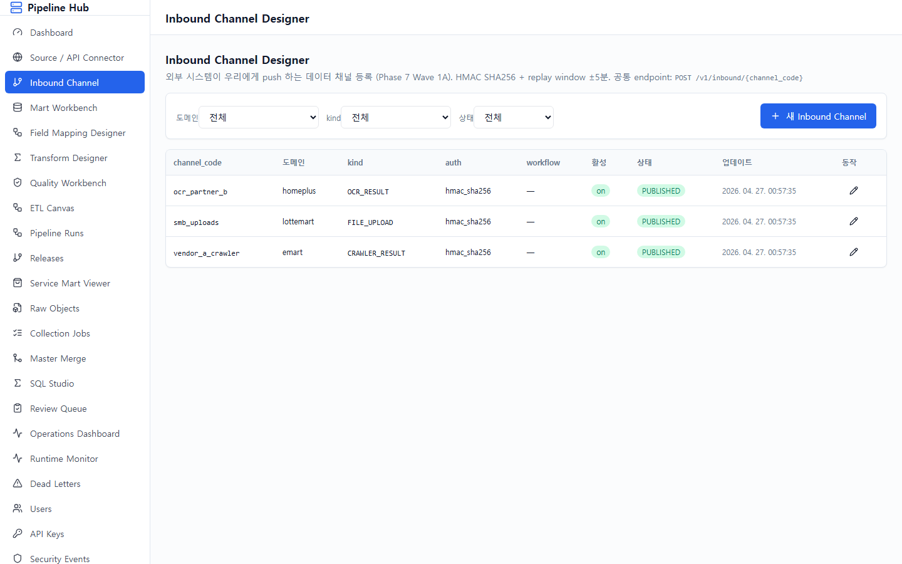

**기능**: *우리가 fetch* 가 아닌 *외부에서 push* 하는 채널 등록. HMAC SHA256 +
replay window ±5분 + idempotency key 강제.

**시나리오 적용**:
- `vendor_a_crawler` (CRAWLER_RESULT) — 외부 크롤링 업체 push
- `ocr_partner_b` (OCR_RESULT) — 외부 OCR 업체가 결과 push
- `smb_uploads` (FILE_UPLOAD) — 소상공인 CSV/Excel 업로드

**Endpoint**: `POST /v1/inbound/{channel_code}` (예: `/v1/inbound/vendor_a_crawler`)

**다음 스텝**: **"Mart Workbench"** → 4 유통사용 mart 테이블 + 적재 정책 설계.

---

## STEP 5 — Mart Workbench (Mart Schema + Load Policy)

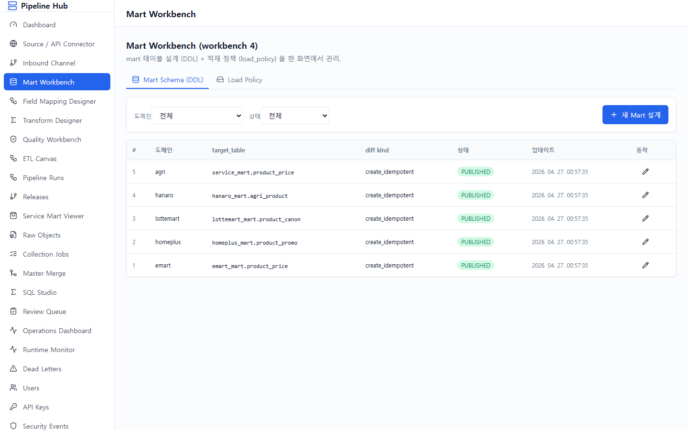

**기능**: 두 탭으로 구성:
1. **Mart Schema** — 컬럼 / 타입 / PK / partition / index 폼 → DDL 자동 생성
2. **Load Policy** — append_only / upsert / SCD2 / current_snapshot 모드 + key_columns

**시나리오 적용**: 5개 mart_design_draft + 5개 load_policy 모두 `PUBLISHED`:
- 4 유통사 mart (각 도메인별)
- `service_mart.product_price` (4 유통사 통합)

모두 `mode=upsert`, `key_columns=[retailer_code, retailer_product_code]`.

**다음 스텝**: **"Field Mapping Designer"** → API 응답 → mart 컬럼 매핑.

---

## STEP 6 — Field Mapping Designer

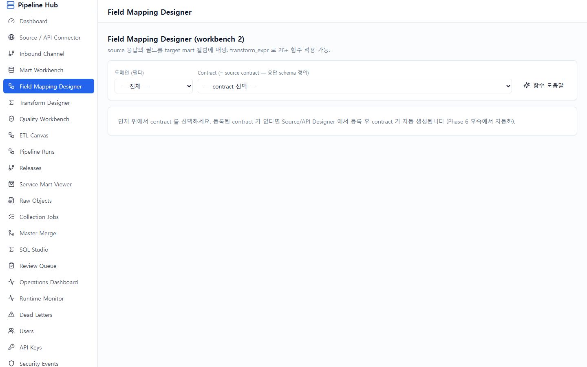

**기능**: source 응답의 JSONPath → target mart 컬럼 매핑. 26+ allowlist 함수
(text.trim / number.parse_decimal / date.parse 등) 적용 가능.

**시나리오 적용**: 4 contract × 평균 5 매핑 = **21 매핑 rows**.

예시 — 하나로마트:
| source_path | target_column | transform | type |
|---|---|---|---|
| `$.product_cd` | `product_cd` | — | TEXT |
| `$.name` | `name` | — | TEXT |
| `$.origin` | `origin` | — | TEXT |
| `$.grade` | `grade` | — | TEXT |
| `$.unit` | `unit` | — | TEXT |
| `$.price` | `price` | — | NUMERIC |

**다음 스텝**: **"Transform Designer"** → SQL Asset / HTTP / Function / Provider
4탭에서 변환 자산 등록.

---

## STEP 7 — Transform Designer

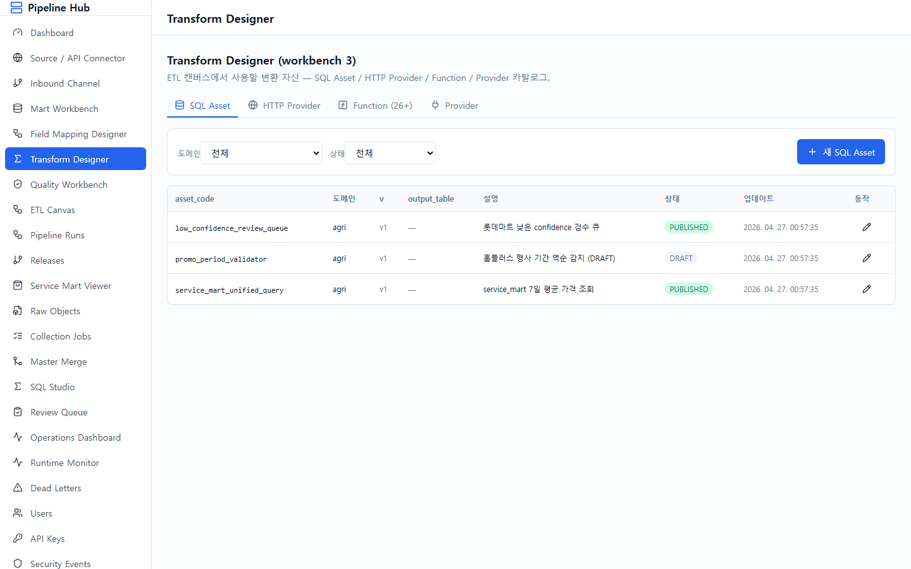

**기능**: 4 탭 — SQL Asset (등록·승인된 SQL) / HTTP Provider (외부 정제 API) /
Function 카탈로그 / Provider 등록.

**시나리오 적용**:
- 3 SQL Assets — `service_mart_unified_query` (PUBLISHED) /
  `low_confidence_review_queue` (PUBLISHED) / `promo_period_validator` (DRAFT)
- 8 Providers (Phase 7 Wave 3 시드) — OpenAI / Clova HCX / juso.go.kr / etc.

**다음 스텝**: **"Quality Workbench"** → DQ Rule + 표준코드 namespace.

---

## STEP 8 — Quality Workbench

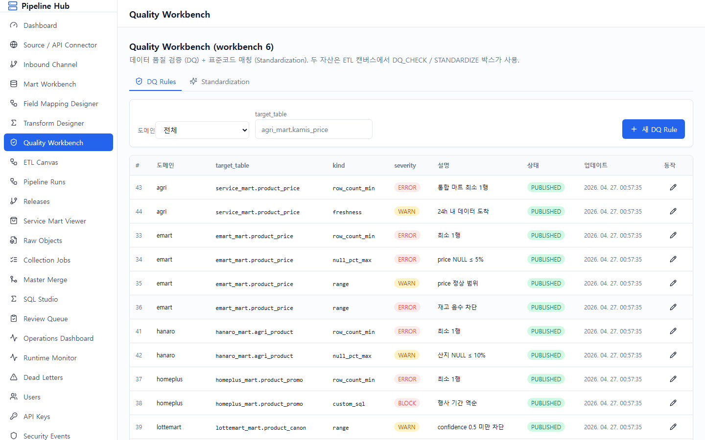

**기능**: 두 탭:
1. **DQ Rules** — 9종 rule_kind (row_count_min / null_pct_max / unique_columns /
   reference / range / custom_sql / freshness / anomaly_zscore / drift)
2. **Standardization** — 표준코드 namespace + std_code_table 미리보기

**시나리오 적용**: **16 DQ rules** PUBLISHED + 1 namespace `STANDARD_PRODUCT`
(10 표준 품목 — 사과/양파/한우 등).

각 유통사별 rule 예시:
- **이마트**: row_count_min(1), null_pct_max(price 5%), range(price 0~1M),
  range(stock_qty 0~100K)
- **홈플러스**: row_count_min(1), custom_sql (행사 종료일 < 시작일 차단)
- **롯데마트**: range(standardize_confidence 0.5~1.0), row_count_min(1)
- **하나로마트**: row_count_min(1), null_pct_max(origin 10%)
- **service_mart**: row_count_min(1), freshness(24h)

**다음 스텝**: **"ETL Canvas"** → 위에서 만든 자산을 박스로 끌어와 조립.

---

## STEP 9 — ETL Canvas v2

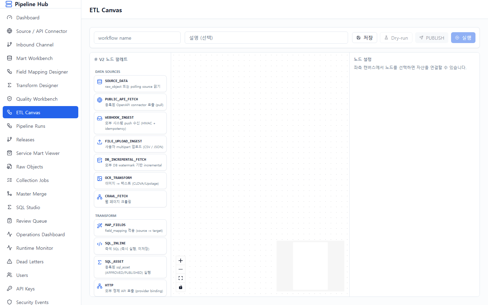

**기능**: 좌측 17종 노드 palette → 캔버스 드래그 → 박스 클릭 시 우측 drawer 에서
자산 dropdown 선택 → 화살표 연결 → 저장 → PUBLISH.

**시나리오 적용**: 5 workflows 시드됨 (모두 PUBLISHED, cron `0 9 * * *`):

```
emart_price_daily         : PUBLIC_API_FETCH → MAP_FIELDS → DQ_CHECK → LOAD_TARGET
homeplus_promo_daily      : 동일 (행사 데이터)
lottemart_canon_daily     : 동일 (정규화)
hanaro_agri_daily         : 동일 (산지/등급)
service_mart_unification  : SQL_ASSET_TRANSFORM (4 유통사 → service_mart 통합)
```

**좌측 palette 노드 17종**:
- DATA SOURCES (8): SOURCE_DATA / PUBLIC_API_FETCH / WEBHOOK_INGEST /
  FILE_UPLOAD_INGEST / DB_INCREMENTAL_FETCH / OCR_RESULT_INGEST /
  CRAWLER_RESULT_INGEST / OCR_TRANSFORM / CRAWL_FETCH
- TRANSFORM (6): MAP_FIELDS / SQL_INLINE / SQL_ASSET / HTTP / FUNCTION /
  STANDARDIZE
- VALIDATE (2): DEDUP / DQ_CHECK
- LOAD (2): LOAD_TARGET / NOTIFY

**다음 스텝**: 캔버스 toolbar 의 **"Dry-run"** → 결과 트리 확인 → **"PUBLISH"**.

---

## STEP 10 — Pipeline Runs

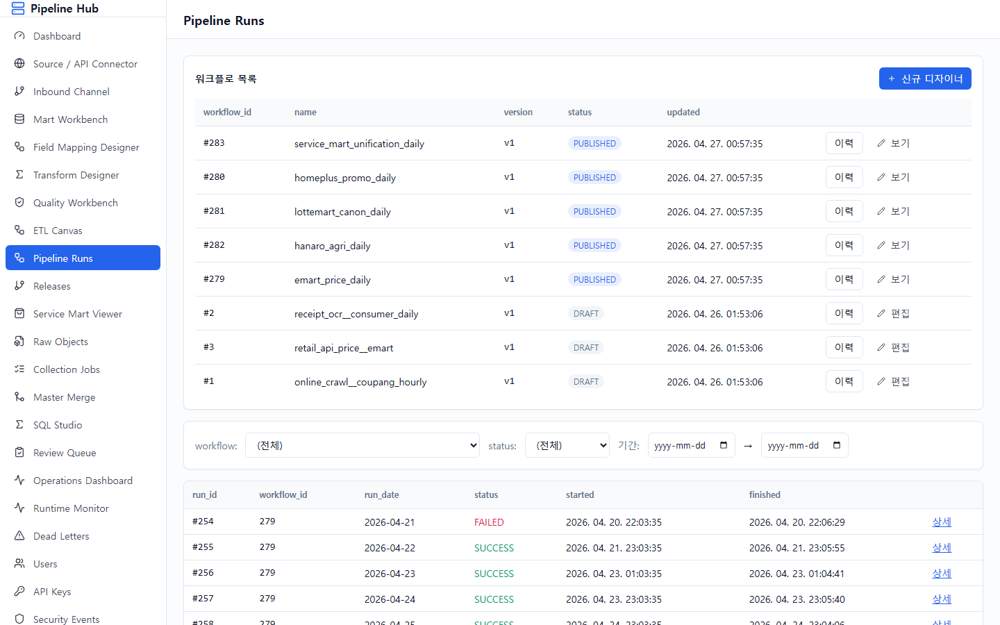

**기능**: 모든 워크플로 실행 이력. 클릭 시 박스별 상세 (PENDING / RUNNING /
SUCCESS / FAILED / SKIPPED) + 실시간 SSE 진행 상황.

**시나리오 적용**: **28 runs** (4 유통사 × 7 일치).

**의도적 실패 케이스** (시나리오상 운영자가 발견해야 할 부분):
- 롯데마트 Day 3 = FAILED (DQ 실패)
- 홈플러스 Day 5 = FAILED
- 이마트 Day 7 = FAILED

각 FAILED run 의 후속 노드는 SKIPPED 처리. 운영자는 상세 화면에서 어느 박스에서
실패했는지 확인 가능.

**다음 스텝**: **"Releases"** → workflow 의 PUBLISHED 이력 확인.

---

## STEP 11 — Releases

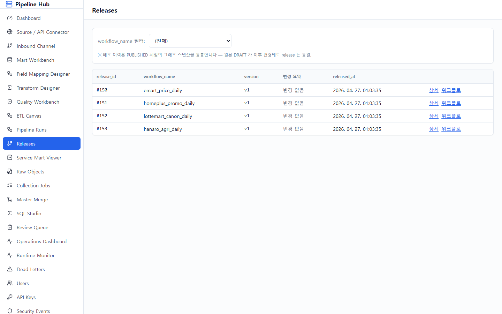

**기능**: workflow 의 PUBLISH 이력. 어떤 버전이 언제 누가 배포했는지. 롤백 가능.

**시나리오 적용**: 4 retailer workflow 의 release v1 시드 — 각 release 는
nodes_snapshot 으로 당시 박스 구성을 보존.

**다음 스텝**: **"Service Mart Viewer"** → 4 유통사 통합 마트 데이터 확인 (시연 핵심).

---

## STEP 12 — Service Mart Viewer ★ 시연 핵심

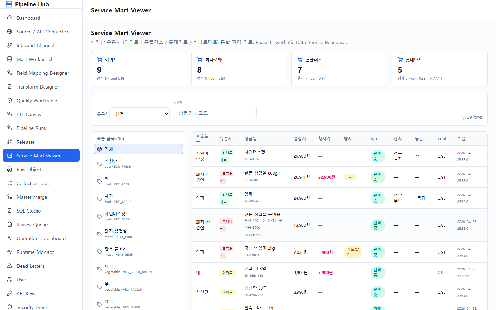

**기능**: 4 유통사 데이터가 동일 구조 (`service_mart.product_price`) 로 통합된
가격 마트 조회.

**시나리오 적용**:
- **상단 카드**: 4 유통사 채널별 통계 (row_count / 행사 / avg_confidence / 검수)
- **좌측 사이드바**: 표준 품목 10종 (사과 / 양파 / 한우불고기 등)
- **우측 표**: 표준품목 / 유통사 / 정상가 / 행사가 / 행사 / 재고 / 산지 / 등급 /
  confidence / 수집

**같은 "사과"가 4 유통사에서 다 다른 상품명으로 들어왔지만 같은 표준 품목 코드
(FRT_APPLE)로 묶임** — 공용 플랫폼의 핵심 시연.

**다음 스텝**: **"Raw Objects"** → 원천 데이터 추적.

---

## STEP 13 — Raw Objects

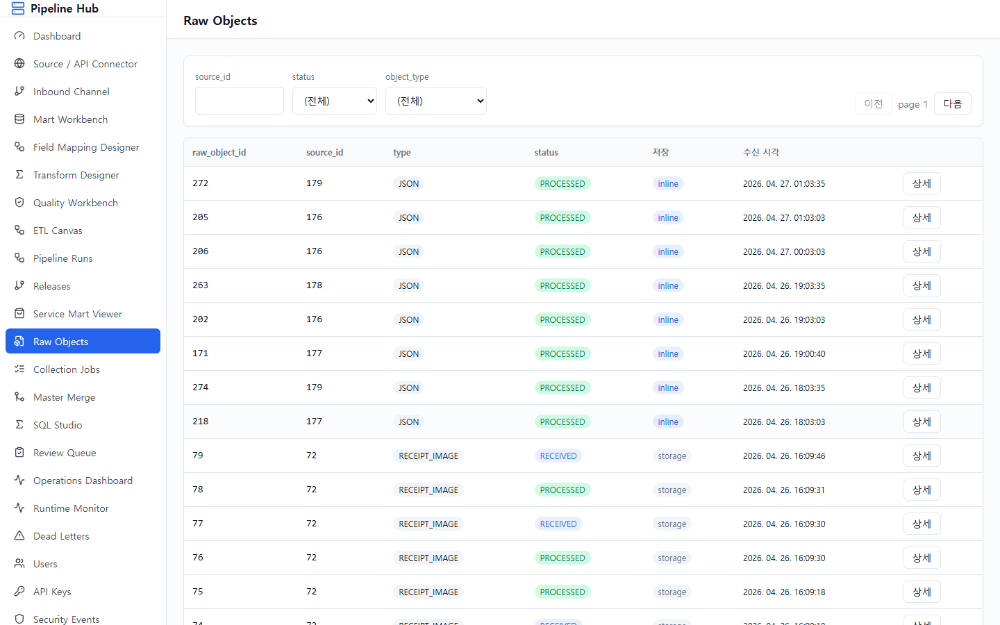

**기능**: API/크롤러/OCR 으로 받은 **raw payload 원본** 보기. idempotency_key 기준
중복 검사. 재처리 시 raw 다시 활용.

**시나리오 적용**: **127 raw rows** 시드 (4 유통사 × 10 + 일부 기존).

partition by `partition_date` (월별). 각 row 는 source_id, content_hash,
payload_json (원본 JSON), object_type=JSON.

**다음 스텝**: **"Collection Jobs"** → 수집 작업 단위 추적.

---

## STEP 14 — Collection Jobs

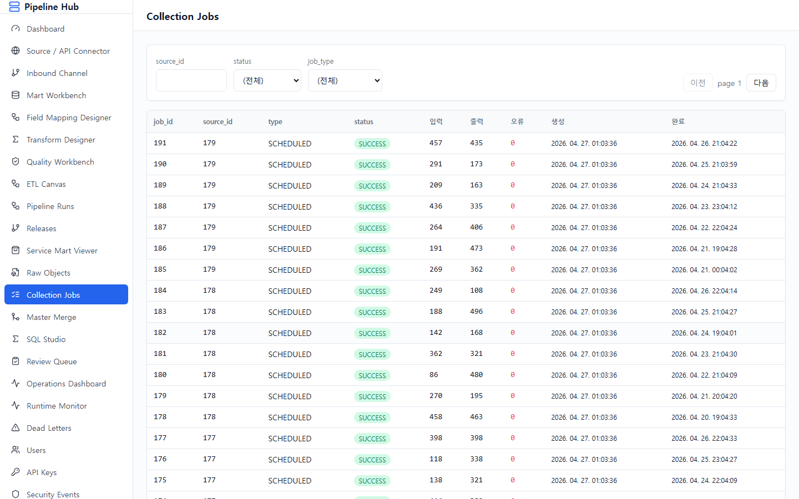

**기능**: 단일 수집 작업 (`run.ingest_job`) 의 상태. 어떤 source 가 언제 trigger
되어 raw 몇 건 받았는지.

**시나리오 적용**: **28 jobs** 시드 (4 유통사 × 7 일).

각 job: SCHEDULED 타입, SUCCESS 상태, input/output count 80~500.

**다음 스텝**: **"Review Queue"** → 검수가 필요한 데이터.

---

## STEP 15 — Review Queue

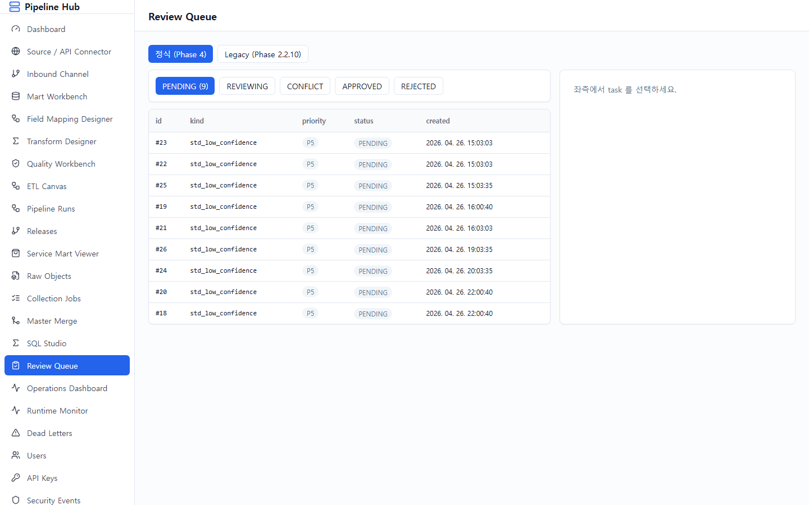

**기능**: 사람의 눈이 필요한 작업 큐. 표준코드 매칭 confidence 가 낮을 때
자동으로 분기.

**시나리오 적용**: **9 review tasks** — 모두 `task_kind=std_low_confidence`.

롯데마트의 confidence < 0.75 데이터 (예: "프리미엄 빨간 과일 봉지", "채소 묶음")
가 검수 큐로 이동. payload_json 에 candidates 후보 (사과 / 배 / 포도) 포함.

**다음 스텝**: **"Operations Dashboard"** → 전체 운영 통합 모니터링.

---

## STEP 16 — Operations Dashboard ★ 운영 핵심

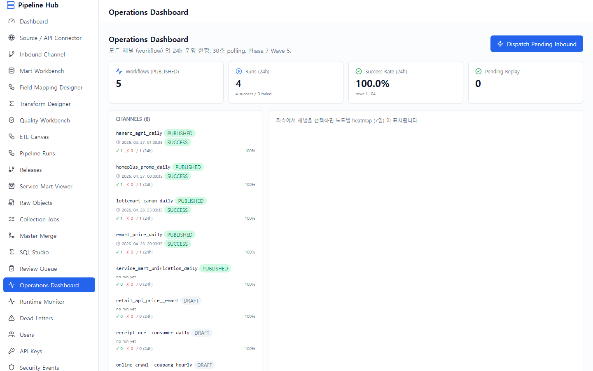

**기능**: 8 channels (workflow) 동시 운영 상태 한 화면.

**시나리오 적용**:
- **상단 4 카드**: Workflows (5 PUBLISHED) / Runs 24h / Success Rate / Pending Replay
- **좌측 채널 목록**: 각 workflow 의 마지막 run 상태 + 24h 성공률
- **우측 heatmap**: 선택된 channel 의 노드별 7d success/failed/skipped color bar

**Wave 6 dispatch**: 우측 상단 "Dispatch Pending Inbound" 버튼 — RECEIVED
상태의 inbound envelope 을 일괄 처리하여 workflow trigger.

**polling**: 30초마다 자동 갱신 (요약). run detail 만 SSE 실시간.

---

## 부록 A — 시나리오 흐름 요약

```
[1] 로그인 (admin/admin)
  ↓
[2] Dashboard 진입
  ↓
[3] Source / API Connector — 4 유통사 API 확인
  ↓
[4] Inbound Channel — 외부 push 3 채널 확인
  ↓
[5] Mart Workbench — 5 mart + 5 load policy
  ↓
[6] Field Mapping Designer — 21 매핑
  ↓
[7] Transform Designer — 3 SQL + 8 provider
  ↓
[8] Quality Workbench — 16 DQ rules
  ↓
[9] ETL Canvas — 5 workflow 박스 조립
  ↓
[10] Pipeline Runs — 28 runs (3 의도적 FAILED)
  ↓
[11] Releases — 4 배포 이력
  ↓
[12] Service Mart Viewer — 29 통합 row (시연 핵심)
  ↓
[13] Raw Objects — 127 원천
  ↓
[14] Collection Jobs — 28 수집 작업
  ↓
[15] Review Queue — 9 검수 task
  ↓
[16] Operations Dashboard — 8 channel 통합 모니터
```

---

## 부록 B — Phase 8 의도적 오류 케이스 매트릭스

| 화면 | 시나리오 | 기대 동작 |
|---|---|---|
| Pipeline Runs | 롯데마트 Day 3 FAILED | downstream SKIPPED |
| Pipeline Runs | 홈플러스 Day 5 FAILED | DQ 실패 메시지 |
| Pipeline Runs | 이마트 Day 7 FAILED | error_message 표시 |
| Service Mart Viewer | 롯데마트 confidence < 0.85 | 행마다 ⚠ 마크 |
| Review Queue | low confidence 9건 | candidates 후보 표시 |
| Operations Dashboard | 채널별 success rate | 100%~75% 범위 |
| Inbound Events (audit) | 일부 FAILED status | schema mismatch 사유 |

---

## 부록 C — 다음 단계 (Phase 9 진입 전 보완)

본 매뉴얼의 시나리오는 **가상 데이터** 기준이며, Phase 9 (실증) 진입 전에 다음을
보완해야 한다:

1. 백엔드 테스트 환경 + Phase 8 E2E 테스트 자동화
2. Inbound 자동화 (수동 dispatch 제거 → outbox actor)
3. 운영 dashboard 의 placeholder 지표 → 실값 연결
4. ETL Canvas 의 사용자 진행 가이드 (1.수집→2.매핑→...→6.배포)
5. Field Mapping 의 시각 매핑 (JSON tree drag&drop)
6. Service Mart Viewer 의 가격 비교 차트 + lineage

상세는 `docs/phases/PHASE_8_1_HARDENING.md` 참조.

---

*문서 끝.*
