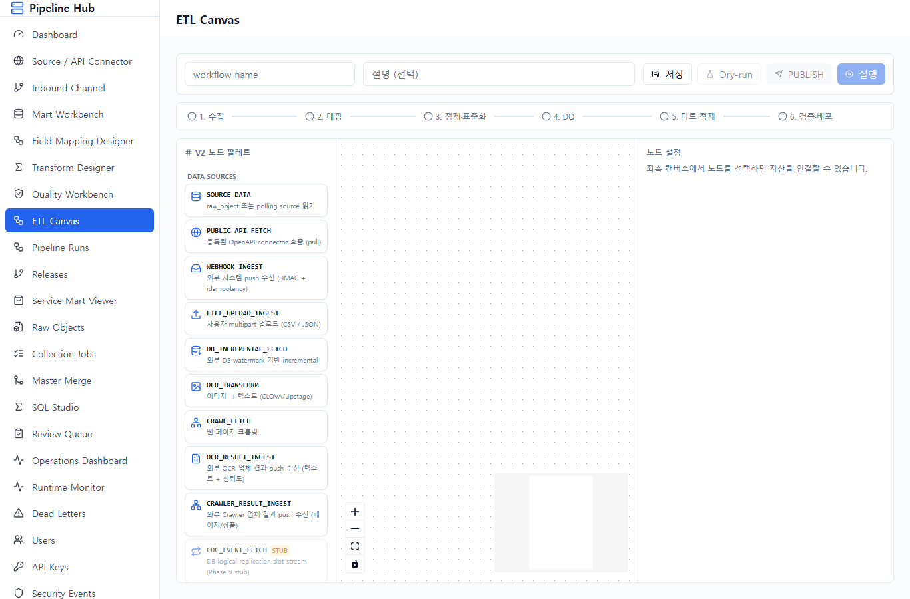
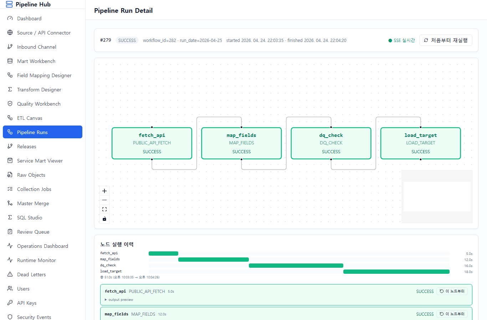
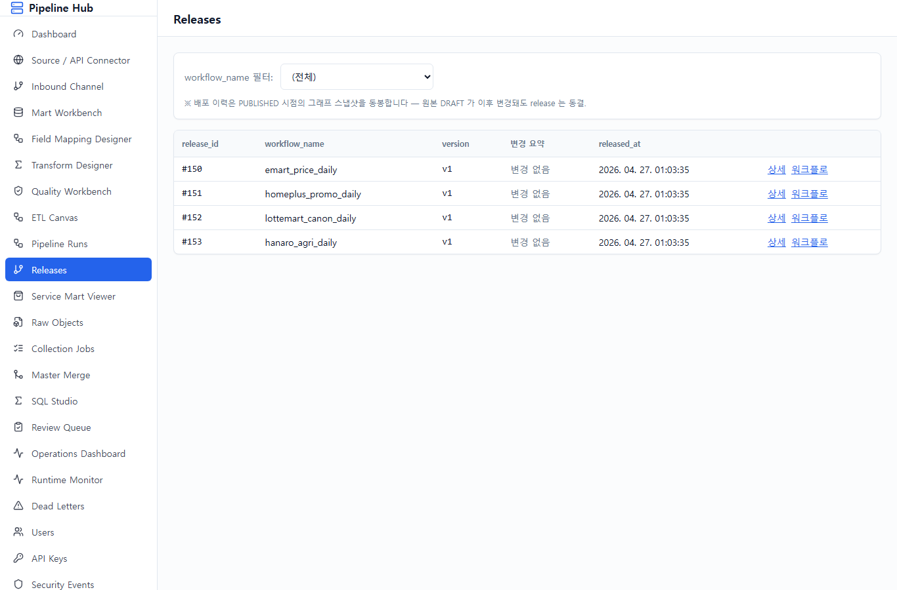
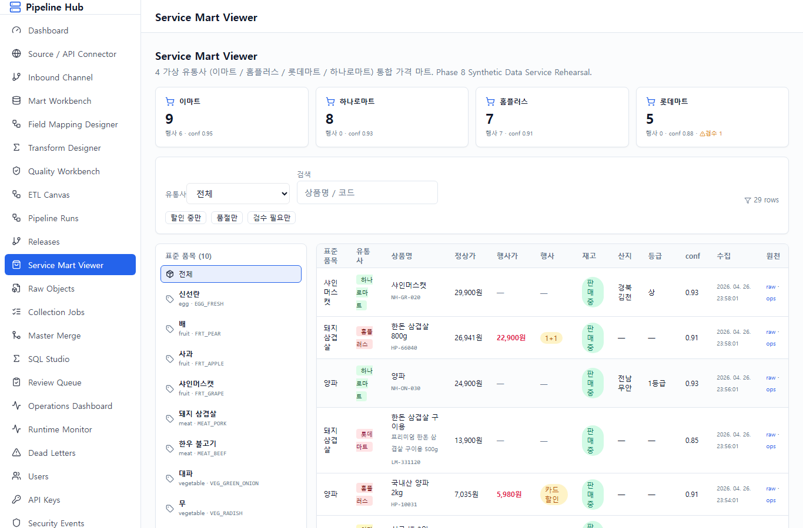
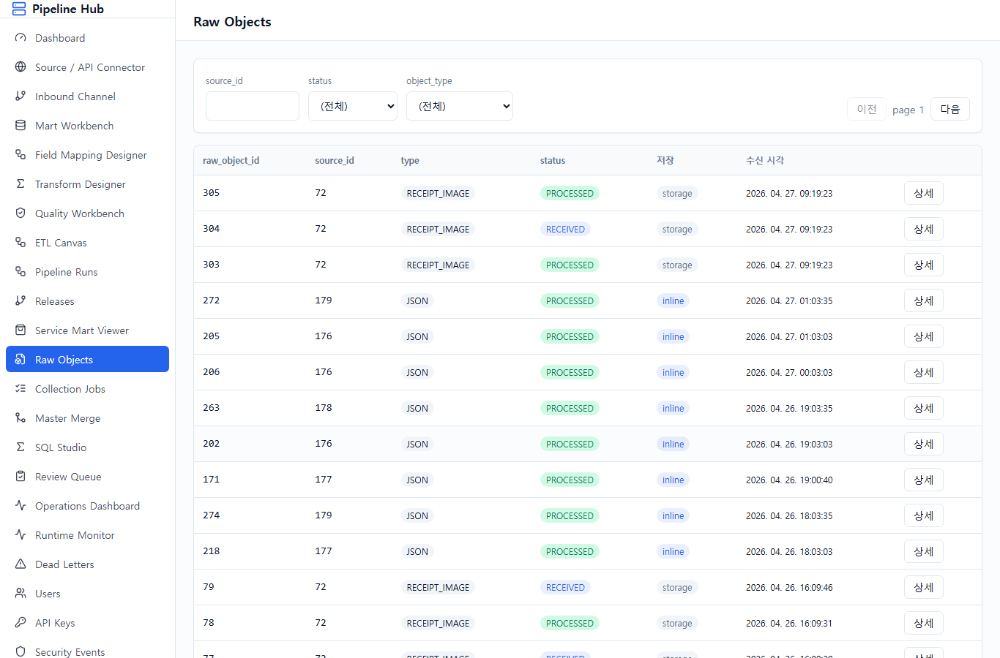
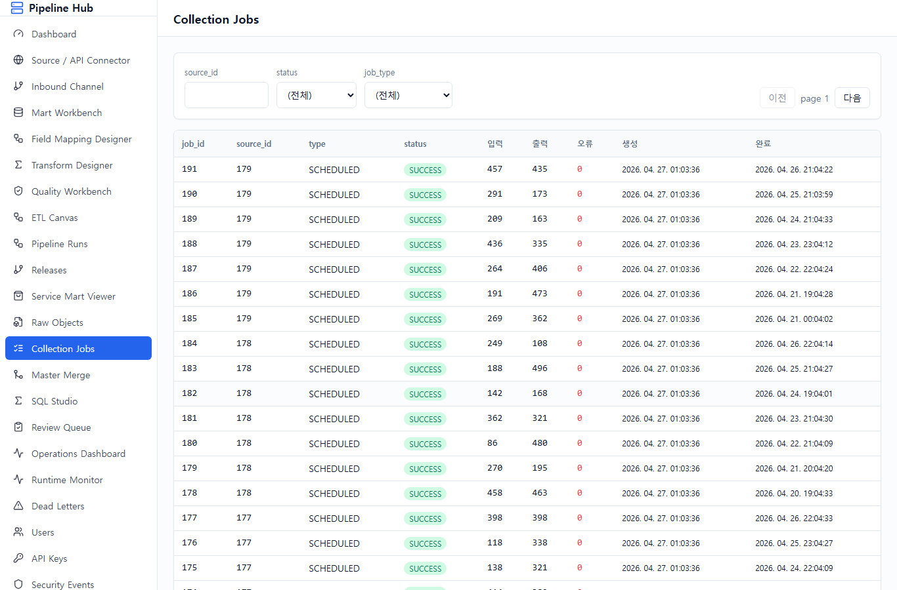
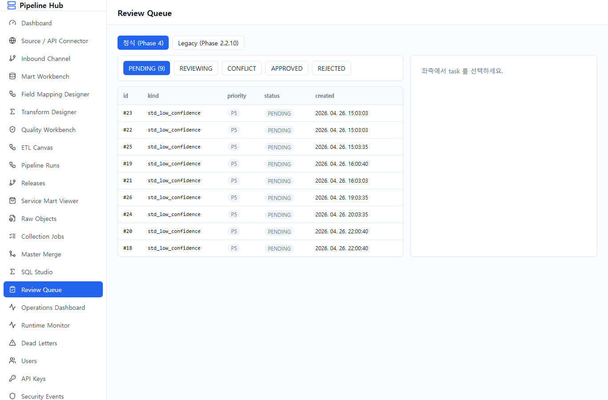
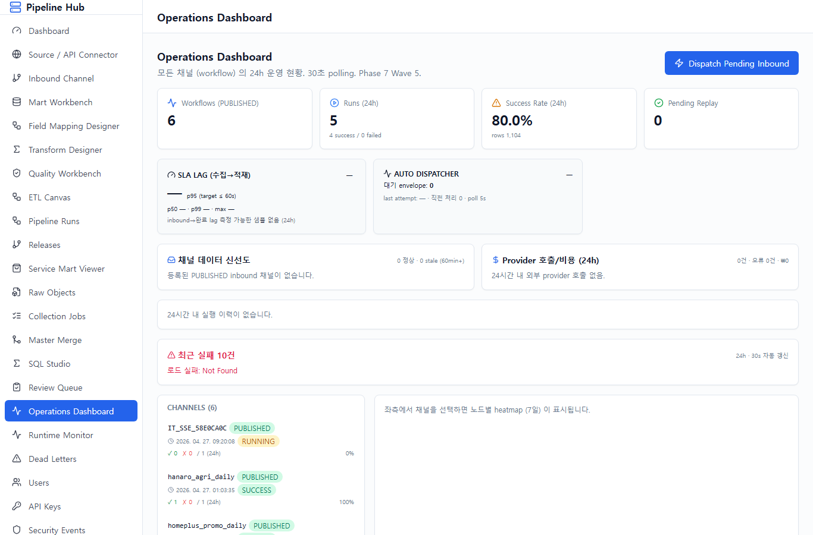

# Pipeline Hub — 시나리오 사용자 매뉴얼

## 매뉴얼 개요

본 매뉴얼은 **공용 데이터 수집 파이프라인 플랫폼** 의 *시나리오 리허설* 화면별
절차서다. 4 가상 유통사 (이마트 / 홈플러스 / 롯데마트 / 하나로마트) 의 가격·행사·재고
데이터를 수집·표준화·통합하는 전체 과정을 메뉴 순서로 정리한다.

**Phase 진행 상태 (2026-04-27 기준)**:

| Phase | 핵심 변경 |
|---|---|
| Phase 8 | 4 유통사 + service_mart 통합 시드 (Synthetic Rehearsal) |
| Phase 8.1 | E2E hardening + Inbound 자동 dispatcher |
| Phase 8.2 | Deep UX — Mart/DQ 템플릿, 자산 상태 배지, JSON path picker, 가격 추이 차트 등 8 영역 |
| Phase 8.3 | DB cleanup — iot_spike_mart / ctl.connector / expired_at 제거 (migration 0052) |
| Phase 8.4 | Final Polish — NodePalette 누락 노드, Inbound API Key 인증, 최근 실패 패널 등 9 영역 |
| **Phase 8.5** | **Real Operation — SLA Lag, Data Freshness, System Alert, Provider Cost (96~98% 완성도)** |

**대상 독자**: 운영자 / 데이터 매니저 / 시연 참관자.
**전제**: 개발자 도움 없이 화면만으로 새 채널 추가, 장애 대응이 가능해야 함.

---

## 0. 사전 준비

### 0.1 인프라 기동

```bash
# Docker — Postgres / Redis / MinIO
cd infra && docker-compose up -d

# Backend — http://127.0.0.1:8000 (Phase 8.5: alert_loop + inbound_dispatcher 자동 가동)
cd backend
.venv/Scripts/alembic.exe upgrade head      # head = 0053
.venv/Scripts/python.exe -c "import asyncio, sys; \
  asyncio.set_event_loop_policy(asyncio.WindowsSelectorEventLoopPolicy()); \
  import uvicorn; uvicorn.run('app.main:create_app', factory=True, host='127.0.0.1', port=8000)"

# Frontend — http://127.0.0.1:5173
cd frontend && pnpm dev

# Phase 8 데이터 시드 (2 단계)
cd backend
PYTHONIOENCODING=utf-8 PYTHONPATH=. .venv/Scripts/python.exe ../scripts/phase8_seed_synthetic_data.py
PYTHONIOENCODING=utf-8 PYTHONPATH=. .venv/Scripts/python.exe ../scripts/phase8_seed_full_e2e.py
```

### 0.2 가상 데이터 채널

| 가상 유통사 | 도메인 코드 | 시연 특징 |
|---|---|---|
| 이마트 | `emart` | 표준 API 형 — 정상 케이스 대표 |
| 홈플러스 | `homeplus` | 행사·할인 데이터 풍부 |
| 롯데마트 | `lottemart` | 상품명 정규화 난이도 높음 (low confidence) |
| 하나로마트 | `hanaro` | 농축수산물 산지/등급/단위 풍부 |

### 0.3 Phase 8.5 신규 운영 기능 요약

- **Auto Inbound Dispatcher** — `inbound_dispatcher_loop` 가 main.py lifespan 에서 5초마다 RECEIVED envelope 자동 처리 (Wave 6).
- **Alert Evaluation Loop** — `alert_evaluation_loop` 가 5분마다 3 rules 평가 (failure_rate / SLA lag / channel stale) — Slack webhook (env `ALERT_SLACK_WEBHOOK_URL`) 또는 log fallback.
- **SLA Lag p95 추적** — CLAUDE.md 핵심 SLA "수집 후 1분 이내" 를 실측 기반으로 모니터.
- **Data Freshness 모니터링** — 채널별 마지막 inbound 수신 + 60min 임계 STALE 표시.
- **Provider Cost 가시성** — KAMIS/CLOVA/Upstage 등 외부 호출 비용 24h 집계.

---

## STEP 1 — 로그인


**기능**: ID / 비밀번호 입력 후 JWT 발급. 권한 (ADMIN / APPROVER / OPERATOR /
REVIEWER) 에 따라 메뉴 노출.

**시나리오 적용**: `admin` / `admin` (Phase 8 시드 기본 계정).

**다음 스텝**: 로그인 성공 시 Dashboard 자동 진입.

---

## STEP 2 — Dashboard


**기능**: 시스템 전반 현황 한 눈에 보기. 활성 소스 / 오늘 수집 작업 / 성공·실패 카운트 + 최근 실패 5건.

**시나리오 적용**: 4 유통사 + service_mart 의 통합 운영 상태 첫 진입 시 확인. 실패가 있으면 즉시 Operations Dashboard 로 이동.

**다음 스텝**: 좌측 메뉴 **"Source / API Connector"** 클릭 → 4 유통사 API 등록 확인.

---

## STEP 3 — Source / API Connector


**기능**: OpenAPI 형 외부 데이터 소스 등록. Phase 8.4 에서 **URL 자동 파싱** 추가 — endpoint_url 에 query string 이 있으면 params 폼으로 자동 분리.

**시나리오 적용**: 이마트 / 홈플러스 / 롯데마트 / 하나로마트 4 connector 가 PUBLISHED 상태로 시드되어 있음. 신규 추가 시 [+] 버튼 → URL 입력 → 자동 파싱 → Auth 설정 → 저장.

**다음 스텝**: 외부 push 채널이 필요하면 **Inbound Channel** 등록 (단방향 push 수신).

---

## STEP 4 — Inbound Channel (외부 Push 수신)


**기능**: 외부 OCR/크롤러/소상공인 업로드 등 *push* 트래픽 수신 채널 정의.

- **인증 방식**:
  - `hmac_sha256` (Stripe 패턴)
  - **`api_key` (Phase 8.4 신규)** — `X-API-Key` 헤더 + `secret_ref` env 매칭
  - `mtls` (Phase 9)
- **Auto Dispatcher (Phase 8.5)**: RECEIVED envelope 을 5초 polling 으로 PROCESSING 전환 → 매핑된 workflow 자동 trigger.

**시나리오 적용**: `vendor_a_crawler` / `ocr_partner_b` / `smb_uploads` 3 채널이 시드되어 있음. 외부 업체 추가 시 채널 코드 / domain / channel_kind / auth_method / secret_ref 입력.

**다음 스텝**: 수집된 데이터를 적재할 mart 가 없으면 **Mart Workbench** 에서 정의.

---

## STEP 5 — Mart Workbench


**기능**: 마트 테이블 DDL 시각 설계 + DRAFT/REVIEW/APPROVED/PUBLISHED 라이프사이클.

- **Phase 8.2 — Mart 템플릿 4종**: `price_fact`, `product_master`, `stock_snapshot`, `promo_fact` — PK/partition/index/load_mode 일괄 적용.
- DDL 자동 생성 + diff 미리보기 후 저장.

**시나리오 적용**: 4 유통사 mart schema (`emart_mart` / `homeplus_mart` / ...) 가 이미 PUBLISHED. 신규 컬럼 추가 시 템플릿 → 컬럼 추가 → DDL 미리보기 → DRAFT 저장 → APPROVE → PUBLISH.

**다음 스텝**: 외부 응답을 mart 컬럼으로 매핑하기 위해 **Field Mapping Designer**.

---

## STEP 6 — Field Mapping Designer


**기능**: 외부 JSON/XML 응답의 source_path → target_column 매핑 + 변환 함수 (26+ allowlist) 적용.

- **Phase 8.2 — JSON Path Picker (시각 매핑)**: 샘플 JSON 응답 텍스트박스 → tree 빌드 → leaf 노드 클릭 시 `source_path` + 추천 변환 함수 자동 입력. `price` → `number.parse_decimal`, `regday` → `date.normalize_ymd` 같은 키 힌트 기반.

**시나리오 적용**: 이마트 응답 `items[].price` → `mart.product_price.unit_price` 매핑 시드 완료. 신규 매핑 추가 시 [+] → 샘플 JSON 붙여넣기 → tree 클릭 → 변환 함수 자동 추천.

**다음 스텝**: 단순 매핑 외 SQL 기반 변환은 **Transform Designer**.

---

## STEP 7 — Transform Designer


**기능**: SQL 자산 (sql_asset) 등록 — DRAFT → APPROVED → PUBLISHED 라이프사이클로 운영 중인 SQL 만 노드에서 사용 가능. version 관리.

- HTTP_TRANSFORM (외부 정제 API 호출, provider binding) 도 같은 메뉴에서 등록.

**시나리오 적용**: `service_mart_unified_query` (4 유통사 통합) sql_asset 이 PUBLISHED. 신규 추가 시 SQL 작성 → Dry-run → APPROVE → PUBLISH.

**다음 스텝**: 적재 전 데이터 품질 룰을 **Quality Workbench** 에서 정의.

---

## STEP 8 — Quality Workbench


**기능**: DQ rule (필수값 / 이상값 / 기간 / 중복 / freshness / anomaly_zscore / drift) 정의 + 실행 결과 조회.

- **Phase 8.2 — DQ rule 템플릿 4 카테고리**: 필수값 / 이상값 / 기간 / 중복. {target_table} placeholder 치환.
- **Phase 8.4 — kind 확장**: freshness, anomaly_zscore, drift.

**시나리오 적용**: `service_mart.product_price.row_count_min` (최소 1행) + `freshness max_age_minutes=1440` (24h 내 데이터 도착) 시드. 신규 추가 시 카테고리 선택 → 템플릿 클릭 → SQL 자동 생성 → 저장.

**다음 스텝**: 자산 (Source / Mapping / SQL / DQ / Mart) 들을 조립하여 **ETL Canvas** 에 워크플로 정의.

---

## STEP 9 — ETL Canvas V2



**기능**: 등록된 자산 박스를 끌어다 놓고 edge 로 연결하여 **코딩 0줄** 로 워크플로 완성.

- **20 노드 (Phase 8.4 검증)**: `SOURCE_DATA`, `PUBLIC_API_FETCH`, `WEBHOOK_INGEST`, `FILE_UPLOAD_INGEST`, `DB_INCREMENTAL_FETCH`, `OCR_TRANSFORM`, `OCR_RESULT_INGEST`, `CRAWL_FETCH`, **`CRAWLER_RESULT_INGEST` (Phase 8.4 노출)**, **`CDC_EVENT_FETCH STUB` (Phase 9 정식 구현)**, `MAP_FIELDS`, `SQL_INLINE_TRANSFORM`, `SQL_ASSET_TRANSFORM`, `HTTP_TRANSFORM`, `FUNCTION_TRANSFORM`, `STANDARDIZE`, `DEDUP`, `DQ_CHECK`, `LOAD_TARGET`, `NOTIFY`.
- **Phase 8.2 보강**: Canvas Readiness Checklist (source/load 박스 존재, asset 선택 검증), 자산 상태 배지 (PUBLISHED/DRAFT 경고).

**시나리오 적용**: `emart_price_daily` 워크플로 = `PUBLIC_API_FETCH → MAP_FIELDS → DQ_CHECK → LOAD_TARGET` 4 박스. Pipeline Runs 화면의 [보기] 버튼으로 진입 시 ETL Canvas V2 에서 그대로 보임.

**다음 스텝**: 작성한 워크플로의 실행 이력은 **Pipeline Runs**.

---

## STEP 10 — Pipeline Runs


**기능**: 워크플로 목록 + 최근 실행 이력. 각 워크플로의 [보기] 버튼은 **Phase 8.5 에서 v2 ETL Canvas 로 라우팅 수정** 됨 (이전 버그: v1 designer 로 갔음).

- **신규 디자이너** 버튼 → ETL Canvas V2 진입 (workflow 신규 작성).
- 실행 행 클릭 → Pipeline Run Detail.

**시나리오 적용**: emart/homeplus/lottemart/hanaro/service_mart_unification 5 워크플로 + 최근 SUCCESS 4건씩.

**다음 스텝**: 특정 run 의 상세 흐름은 **Pipeline Run Detail**.

---

## STEP 11 — Pipeline Run Detail (Phase 8.5 보강)



**기능 (Phase 8.5 ⑥)**:
- ReactFlow 캔버스 — 노드 상태 색상 (PENDING/READY/RUNNING/SUCCESS/FAILED)
- **노드별 duration 시간선 (gantt-mini)** — 각 노드의 시작/종료 + 상대적 길이 시각화
- output_json preview (성공 노드의 결과)
- error_message 강조 박스 (실패 시)
- **재실행 버튼**:
  - 처음부터 재실행
  - **이 노드부터 재실행** (이전 노드는 SUCCESS 로 시드)
- SSE 실시간 — 실행 중 상태 자동 갱신.

**시나리오 적용**: `homeplus_promo_daily` run #279 (SUCCESS, 51초) — fetch_api(5s) → map_fields(12s) → dq_check(16s) → load_target(18s). 운영자가 lag 가 큰 노드를 timeline 으로 즉시 식별.

**다음 스텝**: 운영 환경 배포 이력은 **Releases**.

---

## STEP 12 — Releases



**기능**: PUBLISHED 워크플로 release 이력 + 환경 배포 추적. 각 release 에서 [워크플로] 버튼은 v2 ETL Canvas 로 진입 (Phase 8.5 라우팅 수정).

**시나리오 적용**: 4 유통사 + service_mart 통합 워크플로 release 5건 시드.

**다음 스텝**: 적재된 통합 가격은 **Service Mart Viewer**.

---

## STEP 13 — Service Mart Viewer



**기능 (Phase 8.4 보강)**: 4 유통사 통합 가격 (`service_mart.product_price`) 조회 + 시연용 인터랙션.

- 채널별 통계 카드 (4 유통사 row 수 + 행사수 + confidence + 검수 필요)
- 표준품목 사이드바 + 선택 시:
  - **PriceSummaryCard (Phase 8.4)** — 최저/최고/평균/편차%
  - **PriceCompareCard** — 4 유통사 가격 막대 비교
  - **PriceTrendChart (Phase 8.2)** — 7일 라인 차트
- **필터 토글 3종 (Phase 8.4)**: 「할인 중만」 / 「품절만」 / 「검수 필요만」
- 마지막 수집시간 컬럼 + 「원천」 lineage 링크 (raw / ops)

**시나리오 적용**: 사과 1.5kg 표준품목 클릭 → 이마트(12,900원) vs 홈플러스(11,900원 행사가) vs 롯데마트(13,500원) vs 하나로마트(10,800원) 비교 → 「할인 중만」 토글 → 행사 상품만 노출.

**다음 스텝**: 원천 데이터 추적은 **Raw Objects**.

---

## STEP 14 — Raw Objects



**기능**: 외부 응답을 그대로 보존한 raw_object 목록. content_hash 로 중복 방지, partition_date 로 파티션 분리.

**시나리오 적용**: 4 유통사 raw_object 127건 시드. 운영자가 적재 결과가 의심될 때 채널별 raw 응답 원본 확인.

**다음 스텝**: 시스템이 자동 실행한 작업 이력은 **Collection Jobs**.

---

## STEP 15 — Collection Jobs



**기능**: schedule_cron 또는 manual trigger 로 실행된 ingest_job 이력.

**시나리오 적용**: 4 유통사 ingest_job 28건 + 의도적 FAILED 케이스 1건 시드 (운영자 발견·복구 시연용).

**다음 스텝**: 표준화 confidence 가 낮아 자동 표준코드 결정이 어려운 항목은 **Review Queue**.

---

## STEP 16 — Review Queue



**기능**: `crowd.task` 의 `std_low_confidence` task 검수 — 검수자가 표준코드를 직접 선택하여 보정.

**시나리오 적용**: 롯데마트의 low confidence 매핑 3+ 건 시드 (`삼겹살 600g 등심` 같은 모호한 상품명). 검수 → 표준코드 결정 → 매핑 보정 → 다음 run 부터 자동 적용.

**다음 스텝**: 운영자가 시스템 전체 상태를 한 화면에서 보는 곳은 **Operations Dashboard**.

---

## STEP 17 — Operations Dashboard (Phase 8.5 — Real Operation)



**기능**: 본 매뉴얼의 *운영 핵심*. Phase 8 ~ 8.5 보강이 모두 모인 화면.

### 17.1 상단 KPI 카드 4종 (Phase 7 Wave 5)
- Workflows (PUBLISHED)
- Runs (24h)
- Success Rate (24h)
- Pending Replay

### 17.2 Phase 8.5 — Real Operation 카드 4종
- **SLA Lag (수집→적재)** — p95 색상 (≤60s 녹색 / ≤180s 황색 / >180s 적색). CLAUDE.md "수집 후 1분 이내" 추적.
- **Auto Dispatcher** — RUNNING/STALE 표시, 대기 envelope 수, 마지막 dispatch 시각.
- **채널 데이터 신선도** — PUBLISHED 채널별 마지막 inbound 수신 시각 + 60min 임계 STALE.
- **Provider 호출/비용 (24h)** — provider별 호출수 / 오류수 / 평균 ms / 추정 비용.

### 17.3 Phase 8.2 — 24h 시간별 추이 차트
recharts BarChart — success/failed 누적 막대.

### 17.4 Phase 8.4 — 최근 실패 10건
실패 노드 + 원천 (raw_object / inbound_envelope) 링크 + 재실행 버튼. 30s 자동 갱신.

### 17.5 Phase 8.1 — 실패 원인 분류 (24h)
node_type 별 실패 카테고리 (외부 API 실패 / Inbound 수신 실패 / DQ 실패 / 마트 적재 실패 등).

### 17.6 Phase 7 Wave 5 — Channels (workflow 카드)
6 워크플로 (시드 4 유통사 + service_mart 통합 + IT 테스트) 의 24h 카운트 / 성공률 / 마지막 run 시각. 클릭 시 우측에 노드별 7일 heatmap 노출.

### 17.7 Phase 8.5 ⑤ — System Alert (백그라운드)
- **3 Rules**:
  - `failure_rate_24h` (workflow 실패율 30% 초과, ERROR, 30분 cooldown)
  - `sla_lag_p95` (p95 lag > 180s, WARN, 15분 cooldown)
  - `channel_stale` (60min 이상 inbound 미수신, WARN, 60분 cooldown)
- 5분마다 평가 → cooldown 통과 시 Slack webhook (env `ALERT_SLACK_WEBHOOK_URL`) 또는 log fallback.
- 발사 이력은 `audit.alert_log` 에 적재.

**시나리오 적용**: 운영자가 출근 시 본 화면 1개로 전체 상태 파악.
1. SLA Lag 카드 — 녹색이면 OK, 황색이면 주의.
2. 채널 데이터 신선도 — STALE 채널 있으면 즉시 클릭하여 확인.
3. 최근 실패 10건 — 실패 노드 / 원천 링크 클릭 → Pipeline Run Detail 진입 → 「이 노드부터 재실행」.
4. Provider 비용 — 일일 비용 임계 추적.

**다음 스텝**: 시연 종료. 본 매뉴얼은 모든 메뉴를 한 바퀴 돌아온 시점.

---

## 부록 — Phase 8.5 누적 완성도 추적

| 단계 | 완성도 | 주요 산출 |
|---|---|---|
| Phase 8 | 80~82% | 4 유통사 시드 + service_mart |
| Phase 8.1 | 84~85% | E2E hardening + auto dispatcher |
| Phase 8.2 | 87~88% | Deep UX 8 영역 (템플릿 / picker / 차트 / 배지) |
| Phase 8.3 | 88~89% | DB cleanup (iot_spike / connector / expired_at) |
| Phase 8.4 | 93~95% | Final Polish 9 영역 (NodePalette / API Key / 운영 UX) |
| **Phase 8.5** | **96~98%** | **Real Operation (SLA / Freshness / Alert / Cost)** |

## 부록 — 자동 스크린샷 재생성 방법

```bash
# backend (port 8000) + frontend dev (port 5173) 가동 + Phase 8 seed 적용 상태에서
cd frontend
node scripts/capture_manual_screenshots.mjs

# 특정 run_id 로 detail 스크린샷 재촬영 (기본 279)
MANUAL_RUN_ID=279 node scripts/capture_manual_screenshots.mjs
```

스크립트는 `docs/manual/screenshots/*.png` 17장을 덮어쓴다.

## 부록 — Phase 9 이월

- KAMIS 실증 (Phase 9 main)
- CDC_EVENT_FETCH 정식 구현 (CDC 소스 3+ 또는 500K rows/일+ 시점)
- pgvector IVFFLAT 재정책 (표준코드 1k+ rows)
- 파티션 자동 생성 cron + matview 2종
- intentional-fail Canvas E2E 시나리오 자동화
